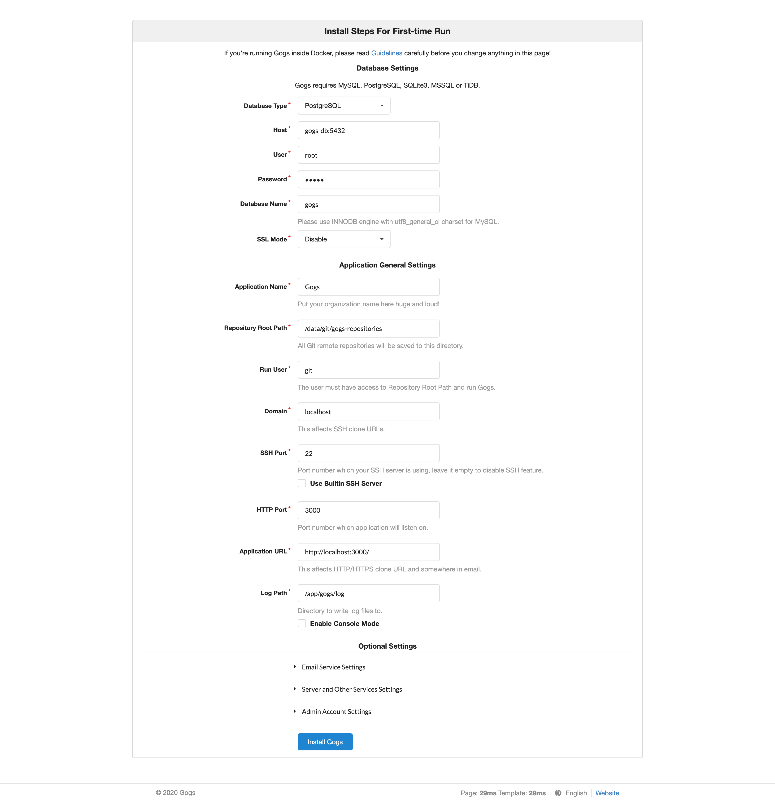

# gogs-macosx

# Requirement

- https://www.docker.com/products/docker-desktop


## 1. Mac - Clone this repository

```
https://github.com/prongbang/gogs-macosx.git
```

## 2. Mac - Run Server

```
$ cd gogs-macosx
$ make run

or

$ docker-compose up -d
```

## 3. Mac - Setup

- ให้เลือกเป็น `PostgreSQL` แทน 
- เปลี่ยน IP `127.0.0.1` เป็น `gogs-db` 

- http://localhost:3000/install

- User Database
```
user: root
pass: admin
db: gogs
```



## 4. Mac - Register

## 5. Mac - Sign In

## 6. Mac - Create Repository

## 7. Mac - Add Remote Repository

```
$ git add remote local http://git-server-ip:3000/username/repository-name.git

or

$ git add remote local http://localhost:3000/username/repository-name.git
```

## 8. Mac - Push to local remote repository

```
$ git push -u local
```

## 9. Windows - (Connect VPN) Git Clone Project from Internal 

```
$ git clone https://git-internal-ip/username/repository-name.git
```

## 10. Windows - Add Remote to git local repository (Mac)

```
$ git add remote local http://git-server-local-ip-mac:3000/username/repository-name.git
```

## 9. Windows - Git pull on Windows

```
$ git pull local
```

## 10. Windows - (Connect VPN) Git push to Internal

```
$ git push
```
